<!-- Improved compatibility of back to top link: See: https://github.com/othneildrew/Best-README-Template/pull/73 -->
<a id="readme-top"></a>
<!--
*** Thanks for checking out the Best-README-Template. If you have a suggestion
*** that would make this better, please fork the repo and create a pull request
*** or simply open an issue with the tag "enhancement".
*** Don't forget to give the project a star!
*** Thanks again! Now go create something AMAZING! :D
-->


<!-- PROJECT SHIELDS -->
<!--
*** I'm using markdown "reference style" links for readability.
*** Reference links are enclosed in brackets [ ] instead of parentheses ( ).
*** See the bottom of this document for the declaration of the reference variables
*** for contributors-url, forks-url, etc. This is an optional, concise syntax you may use.
*** https://www.markdownguide.org/basic-syntax/#reference-style-links
-->
[![Contributors][contributors-shield]][contributors-url]
[![Forks][forks-shield]][forks-url]
[![Stargazers][stars-shield]][stars-url]
[![Issues][issues-shield]][issues-url]
[![MIT License][license-shield]][license-url]
[![LinkedIn][linkedin-shield]][linkedin-url]


<!-- PROJECT LOGO -->
<br/>
<div align="center">
  <a href="https://github.com/KelvinC181/JJK_CI-Hackathon-1">
    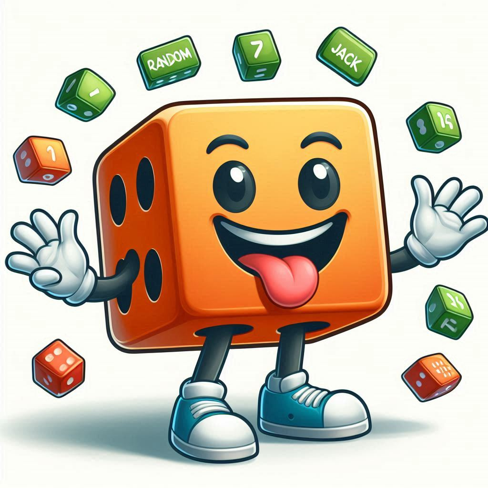
  </a>

<h3 align="center">Random Jack</h3>

  <p align="center">
    An interactive maths game to support those learning at Key Stage levels 1 & 2
    <br />
    <a href="https://github.com/KelvinC181/JJK_CI-Hackathon-1"><strong>Explore the docs »</strong></a>
    <br />
    <br />
    <a href="https://github.com/KelvinC181/JJK_CI-Hackathon-1">View Demo</a>
    ·
    <a href="https://github.com/KelvinC181/JJK_CI-Hackathon-1/issues/new?labels=bug&template=bug-report---.md">Report Bug</a>
    ·
    <a href="https://github.com/KelvinC181/JJK_CI-Hackathon-1/issues/new?labels=enhancement&template=feature-request---.md">Request Feature</a>
  </p>
</div>


<!-- TABLE OF CONTENTS -->
<details>
  <summary>Table of Contents</summary>
  <ol>
    <li>
      <a href="#about-the-project">About The Project</a>
      <ul>
        <li><a href="#built-with">Built With</a></li>
      </ul>
    </li>
    <li>
      <a href="#getting-started">Getting Started</a>
      <ul>
        <li><a href="#prerequisites">Prerequisites</a></li>
        <li><a href="#installation">Installation</a></li>
      </ul>
    </li>
    <li><a href="#usage">Usage</a></li>
    <li><a href="#roadmap">Roadmap</a></li>
    <li><a href="#contributing">Contributing</a></li>
    <li><a href="#license">License</a></li>
    <li><a href="#contact">Contact</a></li>
    <li><a href="#acknowledgments">Acknowledgments</a></li>
  </ol>
</details>


<!-- ABOUT THE PROJECT -->
## About the Project
<div align="center">
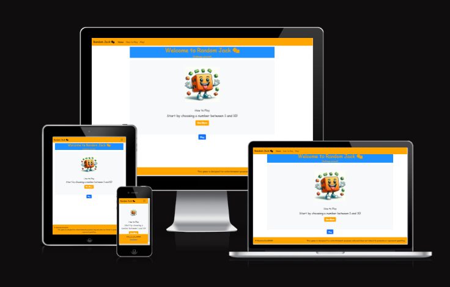
</div>

### Project Overview

This has been designed for the AI Augmented FullStack Bootcamp Hackathon 1 - Front-end with HTML, CSS, and JavaScript.

For our MVP we have decided to create a responsive web based game using HTML, CSS, and JavaScript. This game is to support those learning maths at Key Stages 1 & 2.

### What is it?

A web based game targeted at those with maths abilities at the Key Stage 1 & 2 level. It will initially provide users with an interactive way to practice their mental arithmetic, specifically addition and subtraction.

### High Level View

- Appealing interface
- Approachable and interactive maths game
- Clear and readable documentation
- Working MVP deployed

### How does the game work?

- The game functions by asking the user to enter a number between 0 and 10. 
- Once they submit the number, JavaScript is used to calculate the difference between the user's entered number and a randomly generated number that's also between 0-10. 
- The difference between those numbers are then presented back to the user as a positive integer and represents their roll. 
- The user is then asked to add or subtract their roll from their current total. 
- The current total starts at 0. 
- The user then repeats this process with their new total and a newly entered number. 
- The aim is to reach a total of 21 before they exceed 20 turns.

### Key Dates

- Project Prep Day: 2024/11/27
- Project Start Date: 2024/11/28
- Project Deadline: 2024/12/2 @ 5pm
- Project Presentation: 2024/12/3 @12pm

### More information

Further information on the design process, team structure, and ways of working are contained further into the <a href="#design-process">README.md</a>.

### Built With

* [Bootstrap.com][Bootstrap-url]
* [HTML][html-url]
* [CSS][css-url]
* [JavaScript][js-url]

<p align="right">(<a href="#readme-top">back to top</a>)</p>

<!-- GETTING STARTED -->
## Getting Started

This is an example of how you may give instructions on setting up your project locally.
To get a local copy up and running follow these simple example steps.

### Prerequisites

This is an example of how to list things you need to use the software and how to install them.
* npm
  ```sh
  npm install npm@latest -g
  ```

### Installation

1. Clone the repo
   ```sh
   git clone https://github.com/KelvinC181/JJK_CI-Hackathon-1.git
   ```
2. Install NPM packages
   ```sh
   npm install
   ```
3. Change git remote url to avoid accidental pushes to base project
   ```sh
   git remote set-url origin your_project
   git remote -v # confirm the changes
   ```

<p align="right">(<a href="#readme-top">back to top</a>)</p>

## Design Process
<a id= "design-process"></a>
Below we will list our ways of working, features, design process, and wireframes.

### Process 

We initally began by creating a [Miro Board][miro-url] to kickoff our project with a collaborative session. Within the project kickoff session we covered: 
<!-- HTML to place image and list items next to each other !-->
<div style="display: flex;"> 
  <div style="flex: 1;">
    <p>
      <ul>
        <li>Creating the Miro Board</li>
        <li>Defined the Project Overview</li>
        <li>Brainstormed features</li>
        <li>Mapped our Users</li>
        <li>Mapped our User Stories</li>
        <li>Created our Repository</li>
        <li>Created our Project Board</li>
      </ul>
    </p>
  </div>
<div style="flex: 4; text-align: centre;"> 
<!-- Your image goes here --> 
  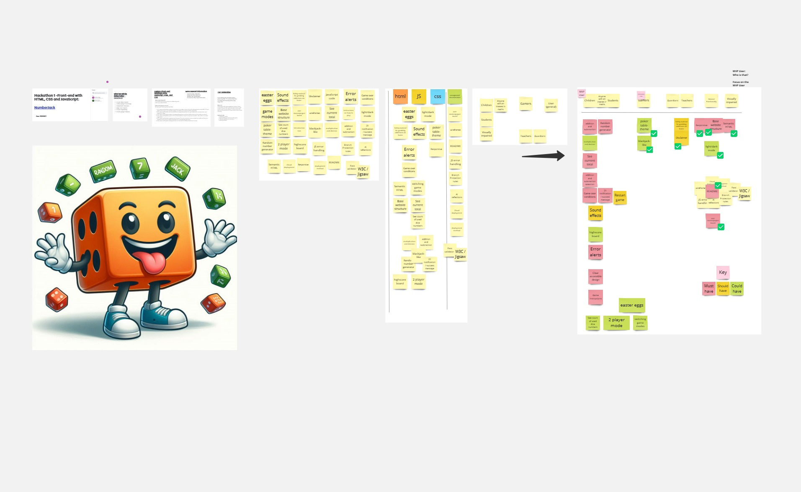 
</div> 
</div>

### Wireframes

- We created a rough outline of our design within MIRO. We designed a desired state for MVP to demonstrate a target state for both the responsive and larger screen version of the page. The reasoning we took this approach was to allow us to begin coding as soon as possible, to then allow us to iterate our design once we had working code.

  Clicking the screenshot below will take you to the Miro board.

  <a href="https://miro.com/app/board/uXjVL_SVyms=/?moveToWidget=3458764608573906668&cot=14">
    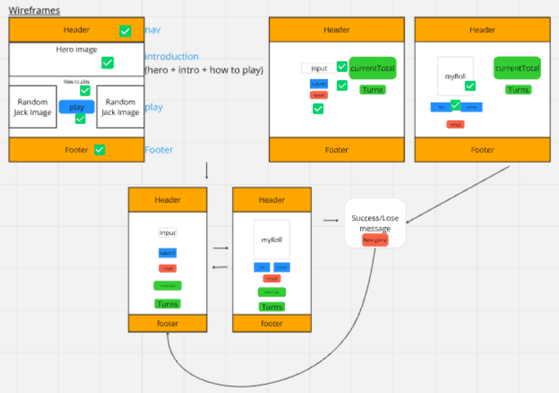
  </a>

### Articial Intelligence Usage

Reflection on key decisions where AI was used focussing on outcomes

#### Overview

- For this project we used AI, specifically Microsoft Copilot to assist the development process. AI was used as our UX Designer, our pair programmer, our code reviewer, and as a prompt for creating certain code functions. This decision was taken to ensure we could focus delivering our MVP for the release deadline. On reflection, this was a huge win for getting started on the project. 

Where we did encounter some challenges, was when diagnosing an issue with a modal. Copilot was unable to determine the issue, leading to a lengthy time discovering the cause of the issue.

#### Character Image

- AI was used as our designer to ensure design consistency and support us at building at speed. This began with AI creating the character image for Random Jack. Using a set of prompts, we were provided with a starting image which we iterated with additional prompts. The second image produded fit our requirements:

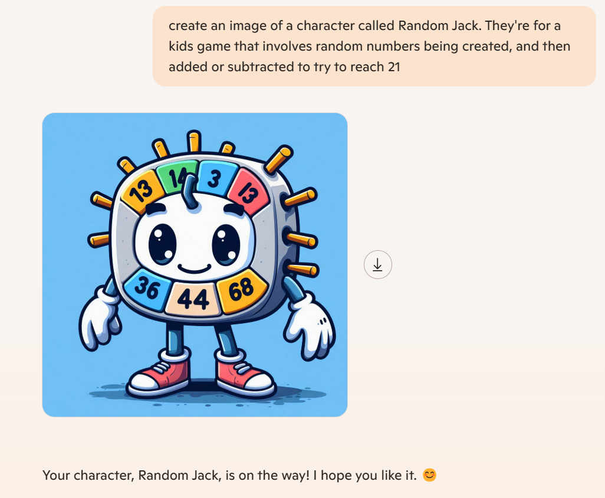
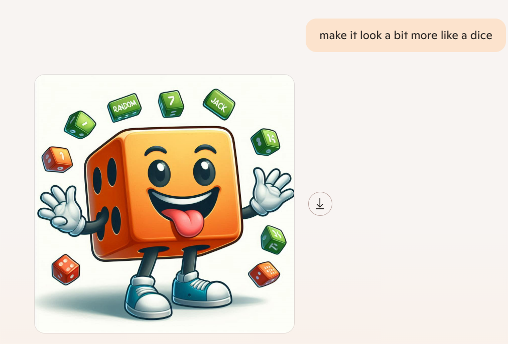

#### Colour Palette

- We then took the existing image for Random Jack and asked Copilot to create a colour palette that would complement the image:

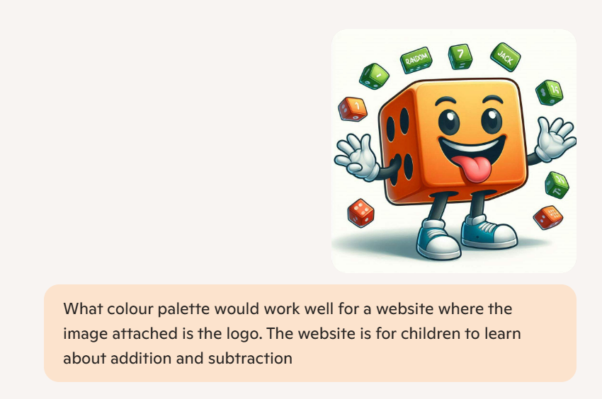
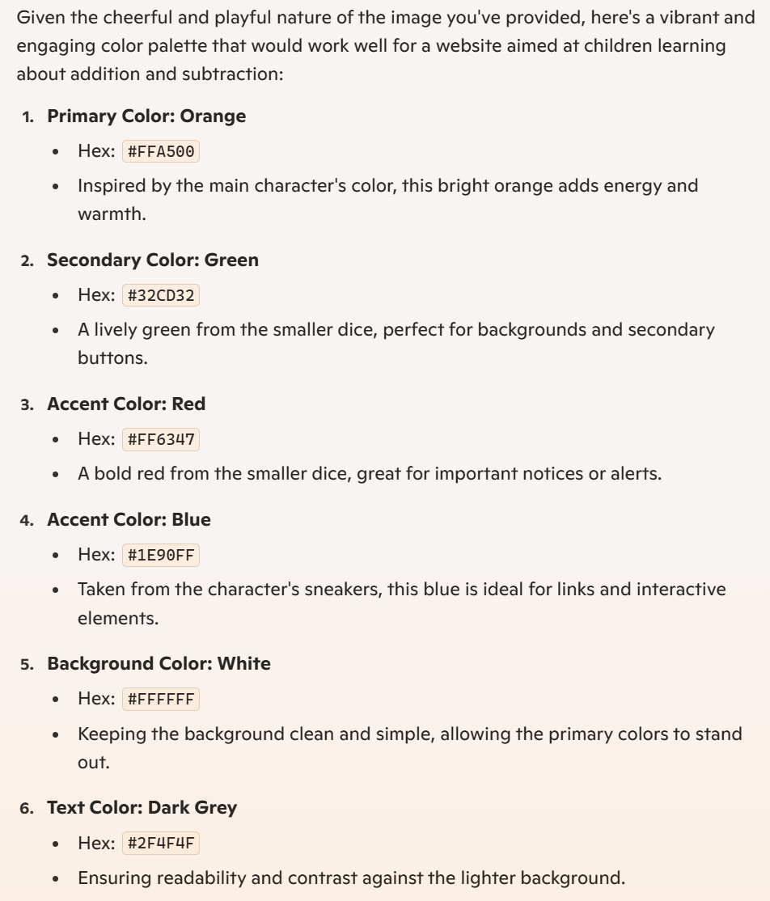

#### Fonts

- By inputting our requirements for the website font, we also asked AI to recommend which fonts would work well for a website aimed at children. They key was they would be welcoming and readable to users developing their maths skills.

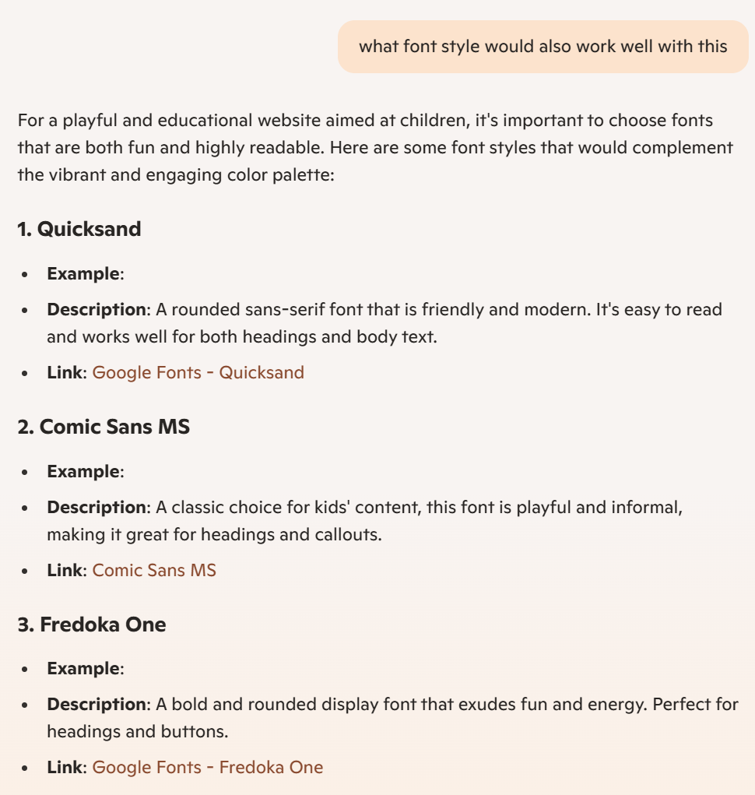

- From here we chose Comic Sans and Fredoka as our primary and secondary fonts. By choosing such a universal primary font, we have insured it will function on all user devices whilst evoking familiarity.

#### Code Branching & Reviews

By using Copilot within Github, we have leveraged Copilots ability to review code for errors. From using the below steps, we would then create a pull request to be reviewed by a teammate before merging our code into the main branch. Our outlined process to create the pull request was:

```sh

 1. Git checkout main
 2. Git pull origin main
 3. Git checkout -b "enter personal branch name"
 4. Git add . 
 5. git commit -m "commit message"
 6. git push origin
 7. Return to Github
 8. Create the pull request

```

For the code reviews, the code reviewer would:

```sh

1. Ask Copilot to review the code for errors
```
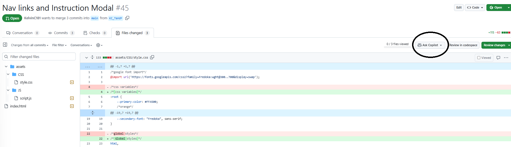

```sh

2. Record any personal observations as well as the Copilot code review
3. If it passed the review, send this back to the developer to merge and then delete their branch

```

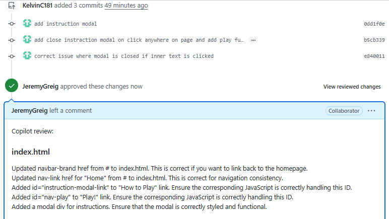


### Bug Identification

- The process for raising any bugs has been to raise them as issue types within Github. They are then assigned to a user to work on within their own branch. Once the code has been locally tested to resolve the issue, merged to main, and demonstrated as working, the bug ticket is moved to done.

The key fields for our bug tickets are:

```sh

Expected Behaviour
Actual Behaviour
Steps to replicate:

```

The ticket type as an issue raised:

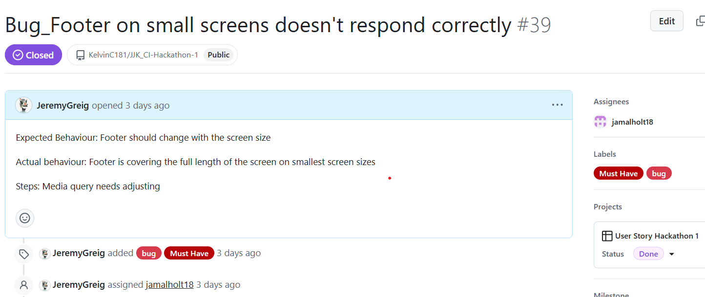

#### Known Bugs

You can view all raised bugs found on the project on the [Bug Project Board][bugs-url]


- AI role in performance and UX improvements

#### 


<!-- Usage EXAMPLES -->
## Usage

Use this space to show useful examples of how a project can be used. Additional screenshots, code examples and demos work well in this space. You may also link to more resources.

_For more examples, please refer to the [Documentation](https://example.com)_

<p align="right">(<a href="#readme-top">back to top</a>)</p>


<!-- ROADMAP -->
## Roadmap

- [ ] 1.0: MVP release - This will include the addition and subtraction functionality
- [ ] 1.1: Add introduction and footer sections. This will include how to text and the disclaimer - [[User Story]][introduction-url]
- [ ] 1.2: Add difficulty modes to increase game scope - [[User Story]][difficulty-url]
    - [ ] Limit number of uses of each number entry
    - [ ] Additional fail conditions
- [ ] 1.3: Add multiplayer [[User Story]][multiplayer-url]
- [ ] 1.4: Add additional arithmetic options [[User Story]][arithmetic-url]
    - [ ] Multiplication
    - [ ] Division
- [ ] 1.5: Add theme selections [[User Story]][themes-url]
    - [ ] Add light/dark mode [[User Story]][lightdarkmode-url]
    - [ ] New skins to appeal to new game users

See the [open issues](https://github.com/KelvinC181/JJK_CI-Hackathon-1/issues) for a full list of proposed features (and known issues).

<p align="right">(<a href="#readme-top">back to top</a>)</p>


<!-- CONTRIBUTING -->
## Contributing

Contributions are what make the open source community such an amazing place to learn, inspire, and create. Any contributions you make are **greatly appreciated**.

If you have a suggestion that would make this better, please fork the repo and create a pull request. You can also simply open an issue with the tag "enhancement".
Don't forget to give the project a star! Thanks again!

1. Fork the Project
2. Create your Feature Branch (`git checkout -b feature/AmazingFeature`)
3. Commit your Changes (`git commit -m 'Add some AmazingFeature'`)
4. Push to the Branch (`git push origin feature/AmazingFeature`)
5. Open a Pull Request

<p align="right">(<a href="#readme-top">back to top</a>)</p>

### Top contributors:

<a href="https://github.com/KelvinC181/JJK_CI-Hackathon-1/graphs/contributors">
  
</a>


<!-- LICENSE -->
## License

Distributed under the MIT License. See `LICENSE.txt` for more information.

<p align="right">(<a href="#readme-top">back to top</a>)</p>


<!-- CONTACT -->
## Contact

Your Name - [@twitter_handle](https://twitter.com/twitter_handle) - email@email_client.com

Project Link: [https://github.com/KelvinC181/JJK_CI-Hackathon-1](https://github.com/KelvinC181/JJK_CI-Hackathon-1)

<p align="right">(<a href="#readme-top">back to top</a>)</p>


<!-- ACKNOWLEDGMENTS -->
## Acknowledgments

* []() Othneil Drew for his amazing "Best-README-Template" on [Github][readme-url]
* []() Dillon Mccaffrey for his support as a our Tutor
* []() Mark Briscoe for his SME support
* []() Microsoft Copilot for being a low maintenance team member

<p align="right">(<a href="#readme-top">back to top</a>)</p>


<!-- MARKDOWN LINKS & IMAGES -->
<!-- https://www.markdownguide.org/basic-syntax/#reference-style-links -->
[contributors-shield]: https://img.shields.io/github/contributors/KelvinC181/JJK_CI-Hackathon-1.svg?style=for-the-badge
[contributors-url]: https://github.com/KelvinC181/JJK_CI-Hackathon-1/graphs/contributors
[forks-shield]: https://img.shields.io/github/forks/KelvinC181/JJK_CI-Hackathon-1.svg?style=for-the-badge
[forks-url]: https://github.com/KelvinC181/JJK_CI-Hackathon-1/network/members
[stars-shield]: https://img.shields.io/github/stars/KelvinC181/JJK_CI-Hackathon-1.svg?style=for-the-badge
[stars-url]: https://github.com/KelvinC181/JJK_CI-Hackathon-1/stargazers
[issues-shield]: https://img.shields.io/github/issues/KelvinC181/JJK_CI-Hackathon-1.svg?style=for-the-badge
[issues-url]: https://github.com/KelvinC181/JJK_CI-Hackathon-1/issues
[license-shield]: https://img.shields.io/github/license/KelvinC181/JJK_CI-Hackathon-1.svg?style=for-the-badge
[license-url]: https://github.com/KelvinC181/JJK_CI-Hackathon-1/blob/master/LICENSE.txt
[linkedin-shield]: https://img.shields.io/badge/-LinkedIn-black.svg?style=for-the-badge&logo=linkedin&colorB=555
[linkedin-url]: https://linkedin.com/in/linkedin_username
[product-screenshot]: images/screenshot.png
[Next.js]: https://img.shields.io/badge/next.js-000000?style=for-the-badge&logo=nextdotjs&logoColor=white
[Next-url]: https://nextjs.org/
[React.js]: https://img.shields.io/badge/React-20232A?style=for-the-badge&logo=react&logoColor=61DAFB
[React-url]: https://reactjs.org/
[Vue.js]: https://img.shields.io/badge/Vue.js-35495E?style=for-the-badge&logo=vuedotjs&logoColor=4FC08D
[Vue-url]: https://vuejs.org/
[Angular.io]: https://img.shields.io/badge/Angular-DD0031?style=for-the-badge&logo=angular&logoColor=white
[Angular-url]: https://angular.io/
[Svelte.dev]: https://img.shields.io/badge/Svelte-4A4A55?style=for-the-badge&logo=svelte&logoColor=FF3E00
[Svelte-url]: https://svelte.dev/
[Laravel.com]: https://img.shields.io/badge/Laravel-FF2D20?style=for-the-badge&logo=laravel&logoColor=white
[Laravel-url]: https://laravel.com
[Bootstrap.com]: https://img.shields.io/badge/Bootstrap-563D7C?style=for-the-badge&logo=bootstrap&logoColor=white
[Bootstrap-url]: https://getbootstrap.com
[JQuery.com]: https://img.shields.io/badge/jQuery-0769AD?style=for-the-badge&logo=jquery&logoColor=white
[JQuery-url]: https://jquery.com 
[introduction-url]: https://github.com/users/KelvinC181/projects/8/views/1?pane=issue&itemId=88892010&issue=KelvinC181%7CJJK_CI-Hackathon-1%7C11
[difficulty-url]: https://github.com/users/KelvinC181/projects/8/views/1?filterQuery=label%3A%22Could+Have%22&pane=issue&itemId=89128092&issue=KelvinC181%7CJJK_CI-Hackathon-1%7C31
[multiplayer-url]: https://github.com/users/KelvinC181/projects/8/views/1?pane=issue&itemId=89130431&issue=KelvinC181%7CJJK_CI-Hackathon-1%7C33
[arithmetic-url]: https://github.com/users/KelvinC181/projects/8/views/1?pane=issue&itemId=89134257&issue=KelvinC181%7CJJK_CI-Hackathon-1%7C34
[themes-url]: https://github.com/users/KelvinC181/projects/8/views/1?pane=issue&itemId=88880525&issue=KelvinC181%7CJJK_CI-Hackathon-1%7C8
[lightdarkmode-url]: https://github.com/users/KelvinC181/projects/8/views/1?pane=issue&itemId=88877831&issue=KelvinC181%7CJJK_CI-Hackathon-1%7C4
[html-url]: https://en.wikipedia.org/wiki/HTML
[css-url]: https://en.wikipedia.org/wiki/CSS
[js-url]: https://www.javascript.com/
[miro-url]: https://miro.com/app/board/uXjVL_SVyms=/
[readme-url]: https://github.com/othneildrew/Best-README-Template
[bugs-url]: https://github.com/users/KelvinC181/projects/8/views/1?filterQuery=label%3Abug